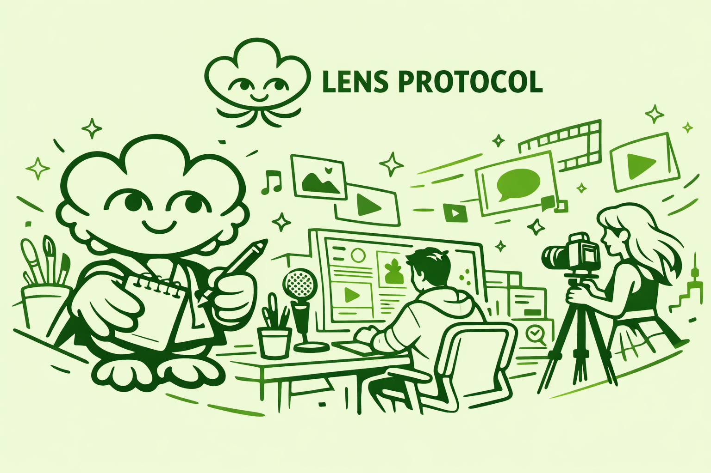

# Lens Creator Skills

[English](./README.md) | [简体中文](./README.zh-CN.md) | [繁體中文](./README.zh-TW.md) | [日本語](./README.ja.md)



使用 agent 创建 Lens 应用。

这个仓库提供了一个 agent skill，用来帮助用户创建基于 [Lens](https://lens.xyz/) 的应用，例如博客、论坛、X-like 社交产品、陌生人社交产品和熟人社区产品。它采用 Lens 的默认优先架构，方便 agent 用更少的基础设施完成真实可用的产品。

## 这个 Skill 是做什么的

`lens-creator-skills` 可以帮助 agent：

- 用实用方式解释 Lens 架构，
- 为真实产品选择合适的 Lens 架构方案，
- 使用 `App`、`Account`、`Username`、`Feed`、`Graph`、`Group`、`Post` 等原语构建应用，
- 实现开户、发帖、回复、关注、时间线、个人主页等常见读写流程，
- 避免不必要的自定义后端和数据库工作。

主 skill 文件见 [`lens-creator-skills/SKILL.md`](./lens-creator-skills/SKILL.md)。

## 什么是 Lens？

[Lens](https://lens.xyz/) 是一个面向开发者的社交协议和生态，用来构建用户拥有身份与关系的社交应用。

在 Lens 中：

- 用户通过 account 和 username 持有自己的身份，
- 社交关系和内容被建模为可组合的开放原语，
- 不同应用可以共享同一套社交图谱，而不是每次都从零开始冷启动，
- 同一套底层能力可以支持多种产品形态，而不只是单一社交应用。

如果你想看更技术化的说明，可以查看官方 [Lens Docs](https://docs.lens.xyz/) 和仓库中的 [`lens-creator-skills/references/lens-architecture.md`](./lens-creator-skills/references/lens-architecture.md)。

## 为什么适合用 Lens 创建社交 App？

Lens 很适合用 agent 快速创建社交产品，原因包括：

- 登录简单：可以用 keypair 快速完成启动和登录流程，
- 基础设施负担小：你主要管理前端和业务逻辑，不需要自己维护完整后端和数据库，
- 成本低：很多真实产品可以直接使用 Lens 默认能力完成，不需要额外搭建复杂协议基础设施，
- 产品形态灵活：你可以创建 blog、论坛、X-like app、陌生人社交、熟人社交等多种应用，
- 迭代快：agent 可以把精力集中在 UI、功能和产品逻辑上，而不是重复搭建社交底层。

## 如何给 Agent 安装这个 Skill

最简单的方式，是直接对 agent 说：

```text
Install this skill: https://github.com/xiaok/lens-creator-skills/tree/main/lens-creator-skills
```

如果你的 agent 支持从本地目录加载 skill，也可以把包含 `SKILL.md` 的目录安装到 skills 目录：

```bash
git clone git@github.com:xiaok/lens-creator-skills.git
mkdir -p "$CODEX_HOME/skills"
cp -R lens-creator-skills/lens-creator-skills "$CODEX_HOME/skills/lens-creator-skills"
```

安装后，直接在提示词里显式调用：

```text
Use $lens-creator-skills to build a Lens app.
```

只要 agent 支持本地 skill 或仓库 skill，就可以使用这个 skill。核心要求是把包含 [`SKILL.md`](./lens-creator-skills/SKILL.md) 的目录以 `lens-creator-skills` 这个名称接入进去。

## 示例

[lens-forum-five.vercel.app](https://lens-forum-five.vercel.app/) 是一个使用这个 skill 创建的《杀戮尖塔 2》游戏论坛。

根据项目说明，它只用了一个提示词，以及一个 20 美元 Codex 订阅大约 5% 的周限额。

这个仓库里也包含本地示例：

- [`/forum`](./forum)：Lens 论坛应用
- [`/blog`](./blog)：Lens 博客应用

## 参考链接

- [Skill 定义](./lens-creator-skills/SKILL.md)
- [Lens 架构说明](./lens-creator-skills/references/lens-architecture.md)
- [Lens 代码模式](./lens-creator-skills/references/lens-code-patterns.md)
